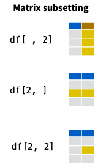
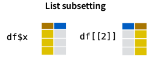
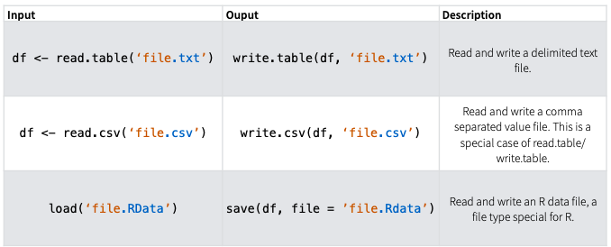
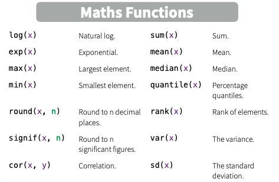
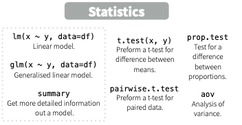
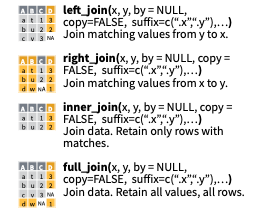
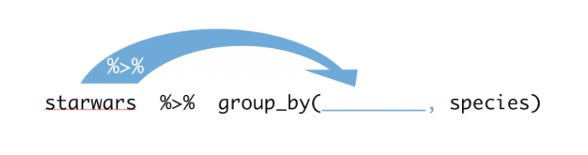

```{r setup, include=FALSE}
knitr::opts_chunk$set(echo = TRUE, fig.path = "figure/listings−", options(width = 54), cache =TRUE)
library(png)
library(tidyverse)
randimage_path <- "/Users/Laura/Dropbox/Screenshots/Screen Shot 2020-08-15 at 10.29.57 AM.png"
randimage <- readPNG(randimage_path, native = TRUE, info = TRUE)


```

## What is R?

R is a language and environment for statistical computing and graphics
* Developed by Ross Ihaka and Robert Gentleman at University of Auckland in 1993
* Based off of an older programming language called S

## Why Use R?
* R is free!
* R is open-source
* Designed specifically for statistical analysis and data reconfiguration
* Extensive package system
* Easy to get started but also powerful
* Amazing support community!

## Today's Goal

```{r echo = FALSE, out.width="75%", out.height="75%" }
library(knitr)
include_graphics("/Users/Laura/Documents/ResearchCode/AMS_RTutorial/Images/r_first_then.png")
```


## What we will cover

* Navigating RStudio
* Basics of R Programming
* Data Manipulation
* Plotting
* RMarkdown

## What we will cover

* Navigating RStudio
    - Live Demo
* Basics of R Programming
* Data Manipulation
* Plotting
* RMarkdown

## What we will cover

* Navigating RStudio
* Basics of R Programming
    - Assignment
    - Data Types
    - Logical Operations
    - Loops
    - Loading Packages
    - Help Files
    - Troubleshooting
* Data Manipulation
* Plotting
* RMarkdown


## What we will cover

* Navigating RStudio
* Basics of R Programming
* Data Manipulation
    - Indices
    - Calculations
    - Cleaning Data
    - Reformatting 
* Plotting
* RMarkdown


## What we will cover

* Navigating RStudio
* Basics of R Programming
* Data Manipulation
* Plotting
    - Base R plots
    - ggplot2
* RMarkdown

## What we will cover

* Navigating RStudio
* Basics of R Programming
* Data Manipulation
* Plotting
* RMarkdown
    - "Knit" Documents
    - Change Output Settings
    - Other Types of Documents
    

## Navigating RStudio
This slide won't actually be included but is a description of what I plan to do
This will be in the form of a live demo. 

* Explain the different panels in R Studio 
* Create an R script/R markdown file
* Run code
* Load packages, look at help files
* Save files/plots


## R Basics 
###Assignment
```{r echo = TRUE}
# Pound signs indicate a line is a comment 
# and will not be run. 

x <- 10 #assigns the variable x to be equal to 10

x #prints x (output should be 10)

print(x) #also prints the value of x

```

## Vectors

To create a vector, we use the c() function (c = combine)

```{r echo = TRUE}
y <- c(1, 2, 3, 4, 5) #creates a vector called y of numbers 1-5

#Alternatively, we can use ":" to get a sequence of numbers

y <- 1:5 
y <- c(1:5)

#Vectors don't have to be numeric either

fruit <- c("apple", "orange", "banana")

fruit
```

##Vectors
Note that if we mix characters and numbers, everything will be converted to the least restrictive data type (character)
```{r}

fruit3 <- c("apple", "orange", "banana", 3)

fruit3
```

##Vectors
We can also generate vectors automatically using a few functions
```{r eho = TRUE}
#Vector of all 1's of length 10
ones <- rep(1, 10) 
ones
#sequence from 1 to 5 by 0.5
x <- seq(1,5, by = 0.5)
x
#10 equally spaced points between 1 amd 5
y <- seq(1,5, length.out = 10) 
y


```

##Selecting Vector Elements By Position
* \textbf{Note indexing in R begins at 1, not 0}

```{r}
z <- 1:10
z[2] #Returns the second element in z
z[c(1,5)] #Returns elements 1 and 5
z[2:4] #Returns elements 2 through 4
z[-3] #Returns all but the 3rd element of z

```
##Selecting Vector Elements By Value
```{r}
z[z<5] #returns all elements of z less than 10
z[z %in% c(9,10,11)]

```

##Generate Random Numbers
```{r echo = TRUE}
#sample 8 values from z
sample(z, 8) #note default is without replacement
#sample with replacement
sample(z, 8, replace = TRUE)
#generate 10 values with a Normal(0, 1) distribution
rnorm(10, 0, 1) 
```

##Different Distributions
```{r out.width="100%", echo = FALSE}
library(knitr)
library(ggplot2)
include_graphics(randimage_path)
```

## Vector Calculations
R is vectorized 
```{r echo = TRUE}
x <- 1:10

x*2 #multiply each element by 2
x*x #element wise multiplication
x/x #element wise division
```

##Matrix

```{r echo = TRUE}
m <- matrix(1:9, nrow = 3, ncol = 3)
m
```

The default is to fill the matrix by columns. Set "byrow = TRUE"" to fill by rows.
```{r echo = TRUE}

matrix(1:9, nrow = 3, ncol = 3, byrow= TRUE)
```

## Matrix Operations

```{r echo = TRUE}
#Transpose
t(m)

#Matrix multiplication
m %*% m
```

## Matrix Operations
```{r echo = TRUE}
#Inverse
m2 <- matrix(rnorm(9), 3, 3)
solve(m2)

#Determinant
det(m2)
```

## Selecting Elements of  Matrix
Select a row:
```{r}
m[2,] #Returns the second row
```
Select a column:
```{r}
m[,1] #Returns the first column
```
Select an element:
```{r}
m[2,3] #Returns the element in the second row, thrid column
```

##Lists
A list is a collection of elements which can be of different types

```{r}
my_list <- list(x = 1:5, y = c("a", "b", "c"))
my_list
```

##Selecting Elements of Lists

New list with only second element:
```{r}
my_list[2]
my_list["y"]
```

##Selecting Elements of Lists
Second element of my_list
```{r}
my_list[[2]] # Second element of my_list

my_list$y #Element named y
```

## Data Frames

A data frame is a special case of a list where all elements are the same length

```{r}
fruit <- c("apple", "orange", "banana")
y <- 1:3
df <- data.frame(fruit, y)
df
```

##Data Frames
We could also name the columns explicitly
```{r}
df1 <- data.frame(fruit = fruit, number = y)
df1
```
##Data Frames

Convert a matrix to a data frame:
```{r}
df2 <- as.data.frame(m)
df2
```
We can rename the columns in our new data frame using "names"
```{r}
names(df2)<- c("x", "y", "z")
df2
```

##Selecting Elements of Data Frames
Subsets of data frames can be done in two ways:
```{r echo = FALSE, out.height="75%"}

```

##Selecting Elements of Data Frames
```{r echo = FALSE}

```

##Logical Operations

```{r echo = FALSE, results = 'asis'}
logical_df <- data.frame(Operation = c("a == b", "a < b", "a <= b", "a > b", "a >= b ", "!a", "a & b", "a | b", "is.na(a)", "a %in% b"), Definition = c("Equal", "Less than", "Less than or equal", "Greater than", "Greater than or equal", "Not a", "a and b", "a or b", "Is missing in a", "a in the set b"))
kable(logical_df)
```

## If statements

```{r eval = FALSE}
if (condition){
  Do something
} else{
  Do something different
}
```
Example:
```{r}
x <- 5
if(x > 7){
  print("Yes")
} else {
  print("No")
}
```

## For Loop

```{r eval = FALSE}
for(variable in sequence){
  Do something
}
```
Example:
```{r}
for(i in 1:5){
  j <- i + 1
  print(j)
}
```

## Writing Functions

```{r eval =FALSE}
function_name <- function(var1, var2, ...){
  Do something
  return(new_variable)
}
```
Example:
```{r}
squared <- function(x){
  squared <- x*x
  return(squared)
}
nth_power <- function(x, n){
  return(x^n)
}
```

## Reading in Data

```{r echo = FALSE, out.height="75%", out.width = "100%"}

```

## Loading Packages

There are many functions that come pre-loaded into R but there are thousands of R packages you can install that give you access to many other useful functions
```{r echo = FALSE, out.width="100%"}
include_graphics("./Images/rstudio-stickers.jpg")
```

##Loading Packages
The \textbf{first} time you use a package in R you will need to install it. 
```{r eval = FALSE}
install.packages("dplyr")
```
After it is installed, you will need to load in that package in every session when you want to use it:
```{r eval = FALSE}
library(dplyr)
```

## Help Files
Help files can be useful if you aren't sure how to use a particular function in R or want information about a particular package.

```{r eval = FALSE}
#?mean (run without the # sign)
```
A question mark followed by the name of the function you want to look up will bring up the help file in the "Help" window

## Troubleshooting

##Common Data Types
```{r echo = FALSE}
kable(data.frame(Type = c("Numeric", "Logical", "Character", "Factor"), Description = c( "Integers or floating point numbers","Boolean Values (TRUE or FALSE)", "Character strings", "Character strings with preset levels")))
```

## Mathematical Functions

```{r echo=FALSE, out.width="100%"}

```

## Basic Statistical Functions

```{r echo= FALSE, out.width="100%"}


```

## Viewing Data

The starwars data set is included in the tidyverse package. Let's start by just viewing the data:
```{r include = FALSE, message = FALSE, warning = FALSE}
#library(readr)
#italy_covid <- read_csv("~/Documents/ResearchCode/Air Quality COVID/Data/italy_covid_data.csv")

#View(italy_covid) # opens a tab to view the whole dataset
#head(italy_covid) # default prints the first 6 rows
#str(italy_covid)  # gives a description of each column and data type
```
```{r}

#View(starwars) # opens a tab to view the whole dataset
head(starwars) # default prints the first 6 rows
```
## Viewing Data

```{r}
tail(starwars)
```


## Viewing Data
```{r}
str(starwars[,1:10])  # gives a description of each column and data type
```

## Exploring Data
```{r}
dim(starwars) # returns dimensions

ncol(starwars) # number of columns

nrow(starwars) # number of rows
```
## Exploring Data
For vectors you can use all the same calls except length() should be used instead of dim()
```{r}
head(z)
str(z)
length(z) # use length instead of dim for vectors
summary(z)
```

## Exploring Data
Now let's explore the starwars data a little closer
```{r }

summary(starwars[,1:10])
```
## Exploring Data
Two ways of learning more about the "character" data types:
```{r}
summary(as.factor(starwars$eye_color))
```
## Exploring Data
Two ways of learning more about the "character" data types:
```{r}
table(starwars$eye_color)
```
## Exploring Data
How can we find out which character has pink eyes? 
```{r}
which(starwars$eye_color == "pink")
```
The character in row 43 has pink eyes
```{r}
starwars[43,]
```

## Exploring Data
There are a lot of ways we could extract this information though:
```{r}
starwars[starwars$eye_color == "pink",]
```
This way is a little cleaner:
```{r eval = FALSE}
ind <- starwars$eye_color == "pink"
starwars[ind,]
```

## Exploring Data
The filter function from the dplyr package also provides a nice clean way of doing this: 
```{r}
filter(starwars, eye_color == "pink")
```


##Cleaning Data

## Reformatting Data
###Long versus wide format:

####Wide data has a column for each variable
  * Wide data is often useful for data entry so observations are commonly imported this way  
  
####Long data has a column for possible variable types and column for the values of those variables
  * Long form data is sometimes needed for statistical modeling and plotting 
  
## Reformatting Data
```{r echo = FALSE, out.height="80%", out.width="100%"}
include_graphics("./Images/tidyr_spread_gather.png")
```

## Wide Data

```{r message = FALSE, warning = FALSE}
library(readr)
italy_covid <- read_csv("~/Documents/ResearchCode/Air Quality COVID/Data/italy_covid_data.csv")

head(italy_covid)

```
## Long Data
```{r}
italy_long <- pivot_longer(italy_covid, 2:26, names_to = "City", values_to = "Cases")

head(italy_long)
```
## Back to Wide
```{r}
italy_wide <- pivot_wider(italy_long, names_from = City, values_from = Cases)
head(italy_wide)
```

## Adding Columns or Rows

Combine vectors, matrices, or data frames
```{r eval = FALSE}
# Combine columns of x and y
cbind(x, y) # x and y need to have same number of rows

# Combine rows of x and z
rbind(x, z) # x and z need to have the same number of columns
```

## Adding Columns
```{r}
df$new = "new"
df$letters = c("a", "b", "c")
df
```

## Mutating Joins
Join one table to columns from another, matching values with the rows that they correspond to. Each join
retains a different combination of values from
the tables.

## Mutating Joins
```{r echo = FALSE, out.width= "100%"}

```

## Select Function
Only keep specific columns by name

```{r}
starwars_small <- select(starwars, name, height, mass)
```

## Mutate Functions
The mutate function will create a new variable from a data set

```{r}
starwars_small <- mutate(starwars_small, 
                         bmi = mass/(height^2))
```
```{r echo=FALSE}
starwars_small
```

## Pipes

Pipes allow you to chain multiple functions together to be run in sequence, with each function operating on the preceding function’s output.

```{r echo=FALSE, out.width = "50%", fig.align="center"}
include_graphics("./Images/pipe.png")
```

## Pipes

```{r echo=FALSE, out.width= "100%"}

```

## Pipes

```{r message = FALSE, warning = FALSE}
starwars %>% 
  group_by(species) %>% 
  summarise(avg_height = mean(height, na.rm = TRUE)) %>% 
  arrange(avg_height)
```
## Pipes
Without pipes you'd have to do something like this:
```{r eval = FALSE}
arrange(
  summarise(
    group_by(starwars, species), 
    avg_height = mean(height, na.rm = TRUE)
  ), 
  avg_height
)
```
Or like this:
```{r eval = FALSE}
x1 <- starwars 
x2 <- group_by(x1, species)
x3 <- summarise(x3, avg_height = mean(height, na.rm = TRUE))
arrange(x3, avg_height)
```

## Pipes
By default, pipes pass the left hand side to the first argument in the next function.

Pipe a result to a specific argument:
```{r}
starwars %>% 
  lm(mass ~ height, data = .)
```


##Plotting

Visualizing data is an important part of exploring and analyzing your data.  We will cover the basics of both "base" R plotting and ggplot2.

##Base R Plots
| Type of Plot | Function |                        
|:-------|:-------|
| Scatterplot | plot(x,...) |
| Line charts | plot(x, type = "l", ...) |
| Histogram | hist(x,...) |
| Box plots | boxplot(x, ...) |
| Bar chars | barplot(height, ...) |

## Optional Arguments for Plotting
Customize these arguments in the "..." parts of plot functions

| Option | Description |                        
|:-------|:-------|
| xlab = "" | x-axis label |
| ylab = "" | y-axis label |
| main = "" | Title label |
| col = "" | Set color |
| cex = | Change size of all elements |
| cex.lab = | Change label size |
| cex.axis = | Change tick mark label size |
| xlim = c( , ) | Set x-axis limits |
| ylim = c( , ) | Set y-axis limits |
| lty = | Change line type in line chart |
| lwd = | Change line width in line chart |
| pch = | Change point type in scatterplot |


## Add to existing plot
| Option | Description |                        
|:-------|:-------|
| func(..., add = TRUE) | Add any plot function to existing plot |
| lines(x,...) | Add line |
| points(x,...) | Add points |
| title(main = , xlab = , ylab = ) | Add labels |
| abline(h = ) | Horizontal line at y=h |
| abline(v = ) | Vertical line at x=v |
| abline(a = , b = ) | Line with intercept a and slope b |
| abline(my_reg) | Best fit line from regression object |

## Multiple Plots at a time
To include multiple plots in one image, you can change the number of plots using the "par" function

```{r eval = FALSE}
par(mfrow = c(nrow, ncol))
```

Plots called after this will be plotted on a grid of nrow and ncol

## Example Plot
```{r}
plot(starwars$height, starwars$mass, xlab = "Height", ylab = "Mass", main = "Star Wars Characters Mass vs Height", pch = 16, col = "magenta")

plot(starwars$height, starwars$mass, xlab = "Height", ylab = "Mass", main = "Star Wars Characters Mass vs Height", pch = 16, col = "magenta",ylim = c(0, 180))
```

## ggplot2
```{r echo = FALSE, out.width="100%" }

include_graphics("./Images/ggplot2_masterpiece.png")
```

## ggplot2

#### ggplot2 is based on the grammar of graphics, the idea that you can build every graph from the same components:
- A Data Set
- A Coordinate System
- Geoms (visual marks that represent data points)

#### Plots made in ggplot2 can be saved as objects and different layers can be added when plotting

## ggplot2
You can use this same code template to make any plot:

```{r eval = FALSE}
ggplot(data = <DATA>, aes(x = <X_VARIABLE>, y = <Y_VARIABLE>)) +
  <GEOM_FUNCTION>()
```

```{r}
p <- ggplot(cars, aes(x = car))
```

```{r}
#colorado_covid %>% filter(sex == "Female" | sex == "Male") %>% ggplot(aes(cdc_report_dt, fill = sex)) + geom_histogram() + facet_wrap(~age_group)
```

##RMarkdown

RMarkdown allows you to both save and execute code and generate high quality reports that can be shared.  

###Document Types:  
- HTML
- Word
- PDF
- Beamer Presentation
- Power Point Presentation
- Shiny Web App
- Many More!

##RMarkdown
```{r echo = FALSE, out.width="100%" }

include_graphics("./Images/rmarkdown_wizards.png")
```

## RMarkdown 
```{r echo = FALSE, out.width="100%" }

include_graphics("./Images/reproducibility_court.png")
```


## Useful RMarkdown Code Chunk Options

```{r echo=FALSE}
kable(data.frame(Option = c("echo", "eval", "include", "message", "warning"), Description = c("Display code in output document", "Run code in chunk", "Include chunk in doc after running", "Display code messages in document", "Display code warnings in document")))
```
## Useful shortcuts 

| Task | Windows | Mac|
|------|------|------| 
| Insert code chunk | Ctrl+Alt+I | Command+Option+I|
| Run current line/selection | Ctrl+Enter | Command+Return |
| Run current chunk | Ctrl+Alt+C | Command+Option+C|
| Comment/Uncomment lines | Ctrl+Shift+C | Command+Shift+C|

## Cheat Sheets

Basics of R: https://rstudio.com/wp-content/uploads/2016/10/r-cheat-sheet-3.pdf

RMarkdown: https://github.com/rstudio/cheatsheets/raw/master/rmarkdown-2.0.pdf

ggplot2: https://github.com/rstudio/cheatsheets/raw/master/data-visualization-2.1.pdf

dplyr: https://github.com/rstudio/cheatsheets/raw/master/data-transformation.pdf

Many Others: https://rstudio.com/resources/cheatsheets/


